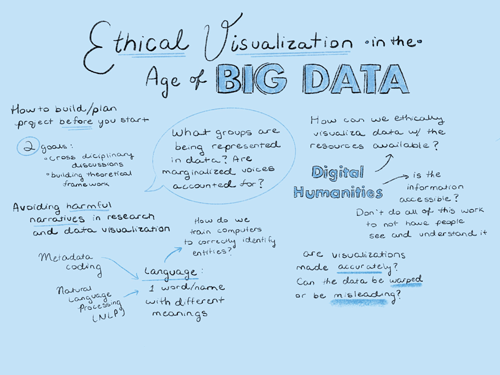
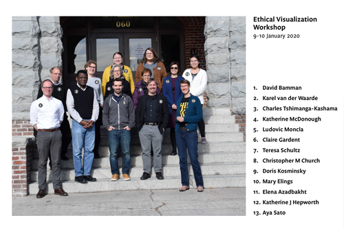

### Planning Workshop Summary

## Contents

### The workshop
- [Overview](#overview)
- [Sessions](#sessions)
- [Participants](#participants)
- [Credits](#credits)

### Documentation
- [Dataset](#dataset)
- [Files](#files)
- [Links](#links)
- [Reflections](#reflections)
- [Related scholarly activity](#related-scholarly-activity)

### Next steps
- [Future activities](#future-activities)
- [Participate](#participate)

------------------------------

## The workshop

------------------------------

### Overview
- [Purpose](#purpose)
- [Ethical data visualization](overview/1.md)
- [Computational processing of French colonial texts](overview/2.md)

#### Purpose
This workshop unites top experts from relevant fields to address the conceptual and logistical challenges of visualizing French colonial historical text without reproducing their inherent ethnocentrism. To this end, the project will address two key issues:
1. how to create ethical data visualizations—and their underlying forms of training and analysis—that grapple with inherent source biases; and
2. how to computationally process non-modern, non-English languages for humanities research in a critically engaged way.

This workshop will lay the foundations for:
- expanding the tools of distant reading and visualization to a broad range of historical sources in ways that attend to their cultural, geographic, and linguistic diversity; and
- identifying and preventing visual perpetuation of pernicious narratives about historical subjects that have persisted from the past into the present.

&nbsp;

------------------------------

### Sessions
1. [Scholarly framing — digital humanities & French colonial history](sessions/1.md)
2. [Metadata structure](sessions/2.md)
3. [Natural language processing (NLP) workflow](sessions/3.md)
4. [Domain adaptation (for early modern French)](sessins/4.md)
5. [Ethical data visualization](sessions/5.md)
6. [Mapping and interface design usability](sessions/6.md)
7. [Adapting and integrating existing open source projects](sessions/7.md)
8. [Input and output (i/o), ongoing maintenance & preservation](sessions/8.md)

&nbsp;

------------------------------

### Participants

#### Organizers
- **[Christopher M. Church](http://www.christophermchurch.com/)**  
    Assistant Professor of Digital History  
    Co-Director, Nevada Center for Data and Design  
    Department of History  
    University of Nevada, Reno
- **[Katherine Hepworth](https://kathep.com)**  
    Associate Professor of Visual Journalism  
    Co-Director, Nevada Center for Data and Design  
    Research Director, Visualizing Science Project  
    The Reynolds School of Journalism  
    University of Nevada, Reno

#### Advisor
- **[Karel van der Waarde](http://graphicdesign-research.com/Karel/Home.html)**  
    Professor of Visual Communication  
    Swinburne University of Technology  
    Melbourne, Australia

#### Invited experts
- **[Charles Tshimanga-Kashama](https://www.unr.edu/history/faculty-staff/charles-tshimanga-kashama)**  
    Associate Professor of History  
    Department of History  
    University of Nevada, Reno  
- **[Katherine McDonough](https://www.turing.ac.uk/people/researchers/katherine-mcdonough)**  
    Senior Research Associate  
    The Alan Turing Institute  
    British Library  
    London, United Kingdom  
- **[Ludovic Moncla](https://lmoncla.ddns.net/)**  
    Maître de conférences in computer science  
    Computer Science Laboratory for Image Processing and Information Systems (LIRIS)
    National Institute of Applied Sciences (insa)  
    Lyon, France  
- **[David Bamman](http://people.ischool.berkeley.edu/~dbamman/)**  
    Assistant Professor  
    Information School  
    University of California  
    Berkeley, U.S.A.  
- **[Mary Elings](https://www.linkedin.com/in/mary-elings-9b244211/)**  
    Assistant Director and Head of Technical Services
    The Bancroft Library  
    University of California  
    Berkeley, U.S.A.  
- **[Claire Gardent](https://members.loria.fr/CGardent/)**  
    CNRS/LORIA  
    Université de Lorraine  
    Nancy, France  
- **[Doris Kosminsky](https://labvis.eba.ufrj.br/en/homepage/)**  
    Professor  
    School of Fine Arts  
    Universidade Federal do Rio de Janeiro  
    Rio de Janeiro, Brazil  
- **[Teresa Schultz](https://library.unr.edu/schultz-teresa)**  
    Assistant Professor  
    University Libraries  
    University of Nevada, Reno  
- **[Elena Azadbakht](https://library.unr.edu/azadbakht-elena)**  
    Health Sciences Librarian  
    University Libraries  
    University of Nevada, Reno  

#### Support staff
- **[Aya Sato](https://twitter.com/dislifeofaya)**  
    Journalism senior  
    Reynolds School of Journalism  
    University of Nevada, Reno

&nbsp;

------------------------------

### Credits

#### Support
This workshop was made possible by the generosity of:
- [National Endowment of the Humanities Office of Digital Humanities](https://www.neh.gov/divisions/odh), Award No. [HAA-266490-19](https://securegrants.neh.gov/publicquery/main.aspx?f=1&gn=HAA-266490-19)
- [Reynolds School of Journalism](https://www.unr.edu/journalism), University of Nevada, Reno
- [College of Liberal Arts](https://www.unr.edu/liberal-arts), University of Nevada, Reno

#### Acknowledgements
In addition to the participants and supporting instituions, this workshop was successful thanks to the contributions of many people, including:
- [Mikki Johnson](https://www.linkedin.com/in/mikki-johnson-4708b084/), Department of History, University of Nevada, Reno
- Mark Higgins, Facilities Management, University of Nevada, Reno
- Sally Echeto and Barbara Trainor, Reynolds School of Journalism, University of Nevada, Reno
- Fatima and Catherine Leland, Silver and Blue Catering, University of Nevada, Reno
- The staff at [Beaujolais Bistro](https://beaujolaisbistro.com/) and [Perenn Bakery](https://www.perennbakery.com/).

&nbsp;

------------------------------

## Documentation

------------------------------

### Dataset
From a technical standpoint, we have cleaned the ocr output for one of these corpora, reaching a high degree of accuracy, well above the standard found in most digital collections, and we have marked-up the text. While the data set is large enough to enable the training of machine learning algorithms, such as named-entity recognition (NER), essential to the analysis of large textual corpora, it is of a manageable size with high accuracy. As a continuous time-series, the corpora also allow for the exploration of how preoccupations changed over the eighteenth and nineteenth centuries. By performing “distant reading” on these “medium data”—too large for traditional reading, but small enough to be managed in a targeted and effective manner—we can unearth the epistemological narratives targeted at the reading public. With the goal of using machine learning to broaden critical engagement with the past, this project will provide guidelines and two key training datasets, the *ARTFL Encyclopédie* and the *Journal des Voyages*, for modeling and analyzing other eighteenth and nineteenth century French sources.

#### Formatted data
- [Add Link](link)
  Description goes here
- [Add Link](link)
  Description goes here
- [Add Link](link)
  Description goes here

#### Memorandum of understanding
Something goes here

#### Data processing notes
The following table outlines the cleaning processes have been performed to arrive at the latest version of our *Journal des Voyages* dataset.

|Version    |Date   |Note   |
|:---|:---|:---|
| [Version x.x](link)   | Add date  | Details go here  |
| [Version x.x](link)   | Add date  | Details go here  |
| [Version x](link)   | Add date  | Data scraped from BnF holdings using ADD TOOL/METHOD |

&nbsp;

### Files
All files are available by downloading the github repository. This includes audio files, briefing materials, presentation files, graphic recordings, and session notes. To browse, hear or see individual files, refer to the individual files in [session](#sessions) pages.

&nbsp;

------------------------------

### Links
- Journal des Voyages at the BnF
- other links

&nbsp;

------------------------------

### Reflections

#### Overall
Add summary of white paper/interim report in plain language here.

#### Session 1
Add something here.

#### Session 2
Add something here.

#### Session 3
Add something here.

#### Session 4
Add something here.

#### Session 5
Add something here.

#### Session 6
Add something here.

#### Session 7
Add something here.

#### Session 8
Add something here.

&nbsp;

------------------------------

### Related scholarly activity

#### Ethical visualization workflow
We have also done extensive work on a prototype ethical visualization workflow, tested with present day materials from the humanities and the sciences. The workshop will allow adaptation of this workflow for ethical visualization of historical textual sources and non-English text mining. For the latest development of this work, see: <https://kathep.github.io/ethics/>

#### Ethical Data Visualization: Taming Treacherous Data course
We teach the method described above as well as how to navigate the concerns explored in this project in the course 'Ethical Data Visualization: Taming Treacherous Data'. This course was offered in 2018 and 2019 at the Digital Humanities Summer Institute (DHSI) at the University of Victoria, Vancouver Island, Canada, and in 2019 at DHDownunder at the University of Newcastle, New South Wales, Australia. See the [DHSI course content](https://github.com/cmchurch/DHSI-ethical-dataviz) and [DHDownunder course content](https://github.com/kathep/DHDownunder-ethical-dataviz) in these repositories.

#### Racism in the Machine paper
We wrote a paper on work prepatory to this workshop, it is available here:
Katherine Hepworth and Christopher Church. 2018. [“Racism in the Machine: Visualization Ethics in Digital Humanities Projects.”](http://www.digitalhumanities.org/dhq/vol/12/4/000408/000408.html) *Digital Humanities Quarterly* 12:4.

#### Make Me Care paper
This paper incorporates some considerations explored at the workshop, and applies them to an expanded view of ethical visualization, beyond the digital humanities.
From Hepworth, K. 2020. (forthcoming) "Make Me Care: Ethical Visualization for Impact in the Sciences and Data Sciences", *HCII Conference 2020 Proceedings*.

&nbsp;

-----------------------------

## Next steps

-----------------------------

### Future activities

#### Visualizing Empire project

Something here.

#### White paper
Something here. Add link.

&nbsp;

------------------------------

### Participate

#### Follow
You can follow development of this work by subscribing to DO WE WANT TO MAKE A NEWSLETTER???

#### Contribute
We welcome communication, contributions, and thoughts on this work, particularly from people in the French diaspora. If you'd like to contribute to the development of this work, please reach out at cchurch at unr dot edu or khepworth at unr dot edu. Referrals to other projects, literature, and methods that may be relevant are welcome, as well as suggestions for improvement or other modes of implementation.

&nbsp;

------------------------------

[Back to top](#ethical-visualization-in-the-age-of-big-data)
