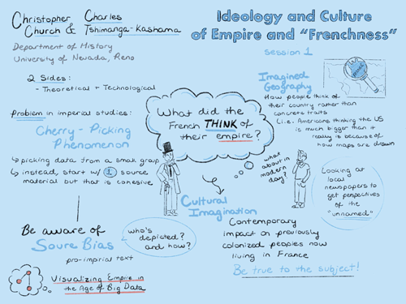

## Session 1: Scholarly framing — digital humanities & French colonial history

### Details
- **Guiding question**  
  What would a postcolonial distant reading and visualization of the corpora look like?  

-	**Considerations**  
  Historiography, theoretical focus, scholarly and source biases

-	**Goal**  
  Defined intellectual focus  

-	**Discussants**  
  Christopher Church (lead) & Charles Tshimanga-Kashama  

### Documentation  
- *Listen:* [Full session audio recording](audio/session1.MP3)   
- *View:* [Session presentation slide deck](link) - MISSING  
- *Read:* [Session notes](https://docs.google.com/document/d/196V79SznVOMz-1G63dCI5LCIg0iVKNmMWCP2aSaxHw0/edit?usp=sharing)

### Discussion Summary
This wide-ranging discussion covered both potential analytic methods and their implications for scholarly inquiry into the French colonial world, with a special focus on how technical decisions either enable or disable avenues of humanistic study. As an overture for the conversations to follow, it interrogated both the ethical considerations and the data to be used in such an analysis, raising concerns with respect to the data storage location, the impact of algorithms and confirmation bias, the role of computer vision, and the potential for visual analysis of non-textual elements contained in the data set.

Principal to the conversation was addressing the best way to visualize an “imagined geography” that served for the French an ideological as well as a political and economic purpose. Not only did preliminary data analysis speak to Eric Hobsbawm’s idea that symbols become more potent after their practical use is over, particularly in light of a heightened focus on the American West, but it also reinforced the necessity of “decentering” Europe in any analytic narrative about the *Journal des Voyages*, which was a purposefully eurocentric publication about colonized peoples.

### Decisions
The key decisions made with respect to scholarly framing were
1. to encode the data to allow analysis to distinguish between people and places within and without the French empire;
2. to decide upon the types of named entities that will be encoded, ensuring that people are not solely represented by “eurocentric” sources;
3. to explore the emotional affect attached to named entities, while maintaining a critical eye to what that says about the French gaze;
4. to create a narrative apparatus using select colonial sources that contradict and/or reshape the historical arguments contained in eurocentric source material; and
5. to build a partnership with the National French Library (BnF) and seek funding related to a more involved collaboration.

&nbsp;

------------------------------

[Back to main page](/empire/)
