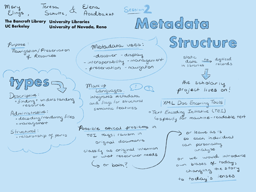

## Session 2: Metadata structure

### Scope and purpose
- **Guiding question**  
  What are the metadata needs for realizing this analysis?

-	**Considerations**
  XML-tags [article (beginning & end), title (beginning & end), image, issue number, issue date, page number], library standards, interoperability   

-	**Goal**	 
  Metadata structural framework   

-	**Discussants** 	
  Mary Elings (lead), Teresa Schultz & Elena Azadbakht

### Documentation  
- *Listen:* [Full session audio recording](audio/session2.MP3)   
- *View:* [Session presentation slide deck](link) - MISSING  
- *Read:* [Session notes](https://docs.google.com/document/d/196V79SznVOMz-1G63dCI5LCIg0iVKNmMWCP2aSaxHw0/edit?usp=sharing)

### Discussion summary
In this session, we discussed the essential though often understated role metadata play with respect to digital humanities projects, particularly the importance of building metadata schema suited to a particular disciplinary context. With the goals of the project in mind, we discussed several potential metadata standards and how well suited they might be to the disciplinary scope of a digital history project.

Additionally, this session addressed the different types of required metadata to describe the assets within the collection, spending time distinguishing what the smallest unit of the collection might be (whether a particular page, article, journal issue, or year) and how we might associate all related assets within a database structure.

### Decisions
Having concluded that the collection would be divided into units at the article level and collected by both issue and year, we resolved to:
1. explore Function Requirements for Bibliographic Records (FRBR), an entity-relationship model created by the International Federation of Library Associations and Institutions. FRBR would be the most viable method for describing the resources within our collection, and it is more user friendly than XML-based standards like The Encoding Initiative (TEI).

&nbsp;

------------------------------

[Back to main page](/empire/)
