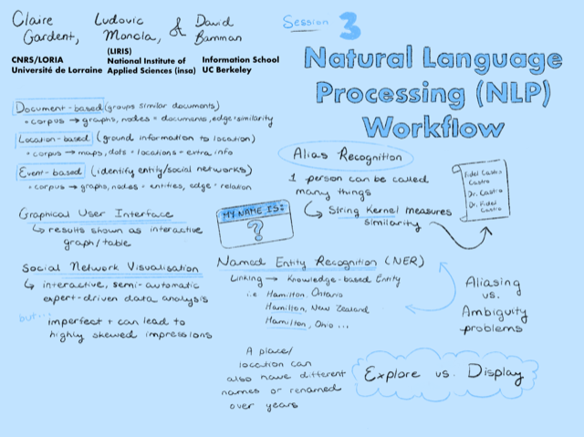

## Session 3: Natural language processing (NLP) workflow

### Scope and purpose
- **Guiding question**  
  Which natural languge processes are most appropriate for this corpora?  

-	**Considerations**  
  Language models, named entity recognition, RNN, dialects, semantic analysis, part of speech tagging, OCR requirements, analytic depth   

-	**Goal** 	
  Roadmap for training and employing NLP model  

-	**Discussants**	  
  Claire Gardent (lead), Ludovic Moncla & David Bamman

### Documentation  
- *Listen:* [Full session audio recording](audio/session3.MP3)   
- *View:* [Session presentation slide deck](link) - MISSING  
- *Read:* [Session notes](https://docs.google.com/document/d/196V79SznVOMz-1G63dCI5LCIg0iVKNmMWCP2aSaxHw0/edit?usp=sharing)

### Discussion summary
During this session, we discussed the technical and conceptual requirements necessary for performing natural language processing on the corpora and the implications of differing approaches. We addressed three approaches to the visualization of text: 1) document-based visualization, which provides a network-based bird’s eye view of multiple documents in order to identify key topics and distinguish between relevant and irrelevant assets; 2) location-based visualization, which allows for the geographic representation of events and generates a map or cartographic visualization from the documents in the corpora; and 3) event-based visualization, which yields a network view of the various entities within a collection of texts.

We discussed the importance of fidelity in annotating texts, regardless of the method employed, as errors can propagate from stage to stage as the project progresses. WIth respect to the naming of entities, disambiguation is frequently the largest hurdle, which is compounded by the necessity for historical gazetteers for place names that may have changed from their historical antecedents. Further, machine learning models are based on probability and frequency, so the most egregious errors may occur with those textual elements that diverge from their most frequent use. Oftentimes in humanistic study, these divergences are the most telling and important.

### Decisions
We decided that we would employ two of the three methods discussed during the session, focusing our efforts on:
1. at least two visualizations of the corpus:
    1. an event-based visualization that looks at the relations between textual entities and correlates them to locations on a physical map,
    1. an event-based network visualization that identifies strength of relationships between textual entities
2. ensuring that the text is never obscured by the visualization apparatus, thus allowing both the researcher and the user to quickly and easily access the original source material.
3. an annotation workflow that includes an inter-annotator agreement analysis.

&nbsp;

------------------------------

[Back to main page](/empire/)
