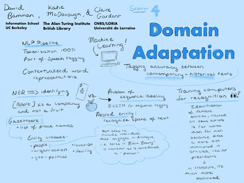

# SESSION 4
## Domain adaptation (for early modern French)

### Details
- **Guiding question:**
  What are the best practices when creating in-domain (early modern French) data for natural language processing and machine learning?  
- **Considerations:**  
  Domain mismatch, validation, annotation tools, training a model (illustrated with NER)  
- **Goal:** 	
  Understanding the risks of out-of-the-box tools and how to overcome them by training new models with your own annotated datas  
- **Discussants:**  
  David Bamman (lead), Katie McDonough & Claire Gardent  

- **Documentation**  
    *Summary:* One sentence here  
    *Listen:* [Full session audio recording](audio/session4.MP3)   
    *View:* [Session presentation slide deck](link) - MISSING  
    *Read:* [Session notes](https://docs.google.com/document/d/196V79SznVOMz-1G63dCI5LCIg0iVKNmMWCP2aSaxHw0/edit?usp=sharing)

&nbsp;

------------------------------

[Back to main page](/empire/)
