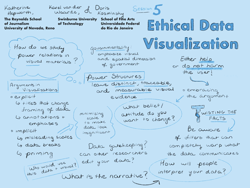

## Session 5: Ethical data visualization

### Scope and purpose
- **Guiding question:**  
  What ethical challenges arise in visualizing this data in this context?  
	**Considerations:**  
  Source and methodological biases, media and design biases, visual rhetoric, ethical visualization, colonial relations, subaltern narratives, audience, agency
	**Goal:**  
  Understanding the risks of intending to produce objective visualizations and how to overcome them by employing ethical visualization practices, formats, and interactions  
	**Discussants:**  
  Katherine Hepworth (lead), Karel van der Waarde & Doris Kosminsky  

### Documentation  
- *Listen:* 
    [Session 5 audio recording PART 1](../audio/session5-1of4.MP3?raw=true) 
    [Session 5 audio recording PART 2](../audio/session5-2of4.MP3?raw=true) 
    [Session 5 audio recording PART 3](../audio/session5-3of4.MP3?raw=true) 
    [Session 5 audio recording PART 4](../audio/session5-4of4.MP3?raw=true)  
-    *View:* [Session presentation slide deck](link) - MISSING  
-    *Read:* [Session notes](https://docs.google.com/document/d/196V79SznVOMz-1G63dCI5LCIg0iVKNmMWCP2aSaxHw0/edit?usp=sharing)  
- *Briefing Documents:*
1. Hepworth, Katherine and Christopher M. Church. 2018. "Racism in the Machine: Visualization Ethics in Digital Humanities Projects." <em> Digital Humanities Quarterly. </em> Volume 12, Number 4. www.digitalhumanities.org/dhq/vol/12/4/000408/000408.html
2. D'Ignazio, Catherine and Lauren F. Klein. 2015. "Feminist Data Visualization." IEEE Paper. http://www.kanarinka.com/wp-content/uploads/2015/07/IEEE_Feminist_Data_Visualization.pdf

### Discussion summary
The discussion started with emphasis on the power structures at work in colonial narratives and in visualizations, and how these power structures leave distinct, traceable, and measurable visual evidence. The group discussed the limitations inherent in the problematic narratives in the source material of Journal des Voyages, and ways to potentially mitigate them. By visualizing the imagined geography represented within this source material, we run a real risk of perpetuating these narratives. We therefore need to make conscious efforts to offer multiple views and contrasting perspectives on our source data.
Discussion then moved to the importance of understanding the ways visualizations amplify and reinforce biases inherent in primary source material by carrying arguments and narratives through rhetorical design elements, compositions, and navigation patterns. The discussion turned toward data availability, the notion of gatekeeping, and finally moved on to the importance of finding, understanding, and targeting those audiences that have an interest in your subject as well as those who have a need that is likely to result in them regularly using your site.

### Decisions
We resolved to:
1. Use visualizations to explore the research question: how does Journal des Voyages contribute to the cultural and ideological momentum necessary for the French empire to maintain itself without an emperor?
2. Research our potential audiences in detail, and understand them and their needs before visualizing. We will look for potential audiences in:
  1. Research communities
  2. Lay communities in the Francophone French diaspora
3. After production, pitch our visualizations project to those audiences to encourage continued use
4. Research potential unintended audiences (such as groups promoting hate speech or xenophobia) and incorporate dissuasion of involvement by those groups.
5. **First product:** Design and release multiple interactive visualizations - one cartographic and one network - with guided pathways that support the argument we intend to communicate through the visualizations (following ethical visualization principles). It should have:
  1. A compassionate user interface designed to mitigate potential for harm within the visualization;
  3. Bilingual translation
  4. An associated site with supplementary text and ‘show your work’ documentation
  2. Guided pathways could be created by using interaction effects such as scrollytelling, tooltips, restricted zoom levels, heavily annotated views.
  5. Consult museum design researchers with regard to guided pathways
6. **Second product:** Jupyter notebooks containing a second level of functionality for the same visualizations, that allows for exploratory interaction with the data. We acknowledge this is a risky undertaking with such a sensitive corpus, and would only allow users to access this functionality after going through a series of disclaimers and agreement interactions (ie an agreement to do no harm with the data).
7. **Final product:** A data repository accessible after signing a memorandum of understanding that commits users to doing no harm with the data and understanding its limitations. This would come last, after reflection on the two other processes. The repository would contain:
   1. base text data;
   2. annotation of text data (our annotation);
   3. images;
   4. image in situ with text
8. Use IIIF technologies to replace the images in locations (current dataset contains low quality bitmap images, BnF has released high quality greyscale versions of them, and may have some color illustrations available)
9. Ask BnF if the higher quality color scans are available

### Further opportunities and considerations
Submit data and paper to Journal of Humanities Data about the thinking around our data cleaning decisions. A second paper discussing the ethics of the visualization project would also be valuable. Participants also suggested possibly submitting one or both of these papers to IEEEVis4DH.

&nbsp;

------------------------------

[Back to main page](/empire/)
