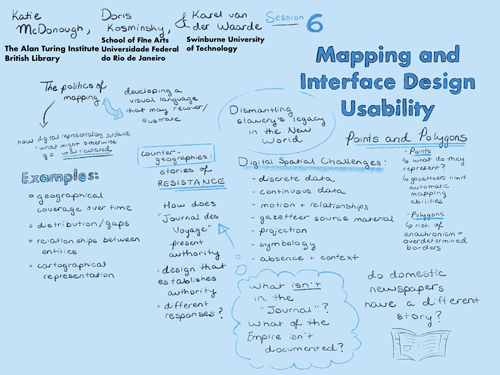

## Session 6: Mapping and interface design usability
 

### Scope and purpose
- **Guiding question:**  
  Which end-user considerations are critical and optimal for interactive mapping?

-	**Considerations**  
  User experience design, graphic user interfaces, data transparency, legibility, cultural geography, geographic power dispersion

-	**Goal**  
  Necessary and preferred usability features  

-	**Discussants**  
  Katie McDonough (lead), Doris Kosminsky & Karel van der Waarde

### Documentation  
- *Listen:* 
    [Session 6 audio recording PART 1](../audio/session6-1of3.MP3?raw=true) 
    [Session 6 audio recording PART 2](../audio/session6-2of3.MP3?raw=true) 
    [Session 6 audio recording PART 3](../audio/session6-3of3.MP3?raw=true) 
- *View:* [Session presentation slide deck](link) - MISSING  
- *Read:* [Session notes](https://docs.google.com/document/d/196V79SznVOMz-1G63dCI5LCIg0iVKNmMWCP2aSaxHw0/edit?usp=sharing)  

### Discussion summary
The discussion started with considering the importance of aesthetics and affect to ethical visualization of data. The affect created by the Visualization of Fear exhibit by artist Kader Attia, was raised as an effective balance of triggering emotion without overwhelming the audience’s capacity to explore the historical content. The unconscious influence on affect of aesthetic decisions was discussed, using the design of a related project, Mapping of Slave Revolt, by Vincent Brown and Elizabeth Maddock Dillon as an example. In this project, the visualizations are rendered with a hand-rendered, period-appropriate feel. Some archival research by some participants suggests that hand-rendering may have considerable influence on making visualizations feel relatable and personally impactful. Period-appropriate aesthetics in the visualization can provide extra reinforcement of historical context, though they should be used with caution in the user interface itself.
The power structures inherent in the corpus were discussed in rounding out the session. The Journal des Voyages was discussed as a tool of governmentality: it taught readers what to imagine about themselves, perhaps more so than about the places depicted, by using geographical coverage, emotional language, and relationships between entities described. In terms of image content, the vast majority of the depictions are of bodies. There are very few maps in the Journal des Voyages, and the ones that are depicted are most commonly in the regular profiles of government departments.
The discussion concluded with exploration of what it might mean to design a compassionate user interface in the context of this corpus. The importance of sketching, hand-drawn aesthetics, choice architecture, and static visualizations was emphasized for creating a compassionate user interface that is graceful in the ways it utilizes human factors for understanding.

### Decisions
We resolved to:
1. Use polygons for storing locations wherever possible (ie for cities, states, regions)
2. Use malleable visualizations (either as notebook outputs or D3.js) in order to make them adaptable for different audiences - potentially as our ‘training wheels off’ second visualization product
3. Frame the Journal des Voyage corpora as a technology of government/governmentality central to ideas of national identity and culture in France

### Further opportunities and considerations
Opportunity for writing about:
1. the corpus as a tool of governmentality, as a theoretical means to explore the phenomena of exceptionalism in the cultural imagination of governing republics, and
2. a short article surveying the compassionate tech initiatives that could inform development of a compassionate user interface for interaction with the corpus.

&nbsp;

------------------------------

[Back to main page](/empire/)
