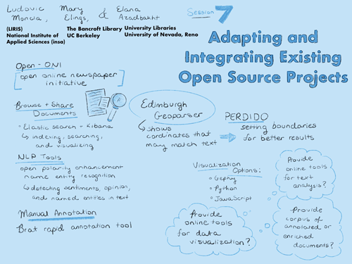

## Session 7: Adapting and integrating existing open source projects
 

### Scope and purpose
- **Guiding question**  
  Which of the available open-source projects may meet project needs?  

-	**Considerations**  
  Open-ONI, OpeNER, Apache, NERC-Fr, Palladio, Voyant Tools, D3  

-	**Goal**  
  Shortlist of open source tools to adapt

-	**Discussants**  
  Ludovic Moncla (lead), Mary Elings & Elena Azadbakht

### Documentation  
- *Listen:* 
    [Session 7 audio recording PART 1](../audio/session7-1of2.MP3?raw=true) 
    [Session 7 audio recording PART 2](../audio/session7-2of2.MP3?raw=true) 
- *View:* [Session presentation slide deck](../pdfs/Session7_Moncla_Adapting%20and%20integrating%20existing%20projects.pdf)  
- *Read:* [Session notes](https://docs.google.com/document/d/196V79SznVOMz-1G63dCI5LCIg0iVKNmMWCP2aSaxHw0/edit?usp=sharing)
- *Briefing Documents:*
  - Sampsel, Laurie J. 2018. "Voyant Tools." <em> Music Reference Services Quarterly, </em>21:3, 153-157, DOI: 10.1080/10588167.2018.1496754
  - Agerri Gascón, Rodrigo, Cuadros Sean Gaines, Montse, and Rigau Claramunt, Germán. 2013. "OpeNER: Open Polarity Enhanced Named Entity Recognition." <em> Sociedad Española para el Procesamiento del Lenguaje Natural. </em> http://dialnet.unirioja.es/servlet/oaiart?codigo=4452510. 

### Discussion summary
During this session, we reviewed several open-source projects, paying particular attention to the research activities and experience of our grant participants.In discussing the available tools, we attended to four main project needs: 1) browsing and sharing the document collection; 2) annotating the corpus; 3) processing the corpus using machine learning, geoparsing, and text mining techniques; and 4) visualizing and exploring the corpus.

### Decisions
We resolved to adapt tools for the following purposes in building our project:
1. Browsing Corpus
**OpenONI, The Online Newspaper Initiative**
which provides a function set for loading, modeling and indexing data
2. Annotating Corpus
**BRAT**
A server-based tool used to annotate the training and verification data for natural language processing
**Pelagios and Recogito**
A semantic annotation tool for texts and images that can identify and map places
**PERDIDO Geoparser**
A flexible geoparser that could be adapted to use a manually annotated gazetteer of historic place names
4. Natural Language Processing
**Spacy**
A flexible python library for natural language processing capable of performing most of the needed project tasks
5. Visualization
**D3, Data-Driven Documents**
A Javascript library that will enable us to make custom visualizations that are web-based and interoperable across browsers

&nbsp;

------------------------------

[Back to main page](/empire/)
