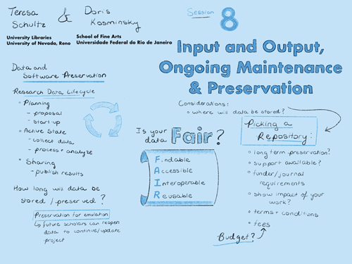

# SESSION 8
## Input and output (i/o), ongoing maintenance & preservation

../ replaced empire
### Details
- **Guiding question:**  
  Which inputs and outputs are critical and optimal? What are the requirements for proper software maintenance and long- term archiving?  

-	**Considerations:**  
  Open and/or widely-used data formats [TXT, CSV, XML, PDF, PNG], consuming the dataset, research outcome formats, interoperability, maintenance costs, data longevity  

-	**Goal:**	 
  Necessary and preferred data formats, importation, and exports, software maintenance and management plan  

-	**Discussants:**	 
  Teresa Schultz (lead) & Doris Kosminsky  

### Documentation  
- **Summary:**  
  One sentence here.
- *Listen:* [Full session audio recording](audio/session8.MP3)   
- *View:* [Session presentation slide deck](link) - MISSING  
- *Read:* [Session notes](https://docs.google.com/document/d/196V79SznVOMz-1G63dCI5LCIg0iVKNmMWCP2aSaxHw0/edit?usp=sharing)

&nbsp;

------------------------------

[Back to main page](/empire/)
